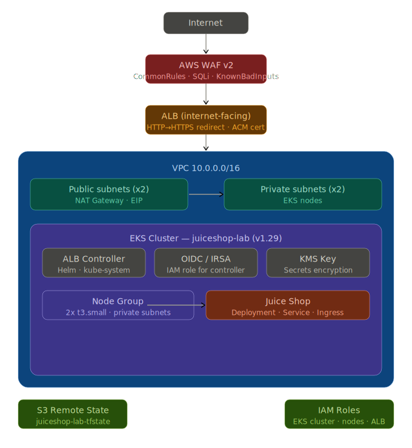

# JuiceShop Lab — AWS Infrastructure
 
## Description
 
This project is a hands-on cloud security lab built to demonstrate practical experience across four key areas:
 
**KMS & Key Management** — The infrastructure uses a customer-managed KMS key (CMK) with automatic key rotation (`enable_key_rotation = true`) to encrypt EKS secrets at rest, enabling granular access policy control and full auditability via CloudTrail — as opposed to relying on AWS-managed keys.
 
**Secure Pipeline Design** — The repository is structured to support an end-to-end secure CI/CD pipeline integrating IaC static analysis (Checkov), automated secrets scanning (GitHub Secret Scanning), and Terraform validation gates before any deployment reaches production.
 
**Formal Security Practices** — The infrastructure follows secure IaC principles throughout: encrypted remote state in S3, EKS nodes isolated in private subnets, IMDSv2 enforced, AWS-managed WAF rules (CommonRuleSet, SQLi, KnownBadInputs), and least-privilege IAM permissions via IRSA instead of static credentials.
 
**Automation** — The entire stack is defined as code in Terraform — networking (VPC, subnets, NAT), EKS cluster, ALB Controller via Helm, and WAF — enabling fully reproducible, auditable deployments and teardowns across environments.
 
---
 
Lab infrastructure to deploy [OWASP Juice Shop](https://owasp.org/www-project-juice-shop/) on AWS EKS with WAF, ALB, and HTTPS.
 
## Diagrama de infraestructura

## Known limitations & future improvements
 
This is a lab environment. The following security improvements are identified but not yet implemented:
 
- **EKS public endpoint is enabled** — `endpoint_public_access = true` exposes the Kubernetes API to the internet. In a production environment this should be set to `false` and access restricted to a VPN or bastion host.
- **No Pod network policies** — there are currently no Kubernetes `NetworkPolicy` resources defined, meaning pods can communicate freely within the cluster. Network policies should be added to enforce least-privilege traffic between namespaces and workloads.
- **Pod security context and restrictive IAM policies** — the Juice Shop deployment has a basic security context but lacks a full Pod Security Admission configuration. IAM policies for the ALB Controller use broad resource `"*"` on several actions that should be scoped to specific ARNs in production.